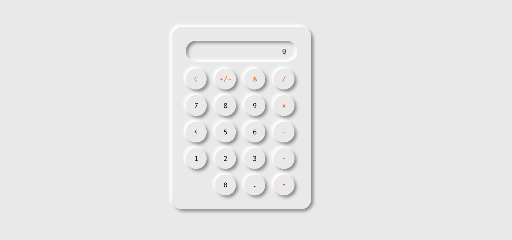

<h1 align="center">
  <br>
  Collection of Responsive Web Applicaitons
  <br>
</h1>

<p align="center">
  • <a href="#how-to-use">How To Use</a> •
  <a href="#built-with">Built With</a> •
  <a href="#use-case">Use Case</a> •
  <a href="#file-structure">File Stucture</a> •

</p>

## Use Case

> This repository consist of different app and comoponent of the application which could be used in different project as open source.

## Check for code from this repo

<a href="https://github.com/Bekhzod96/responsive-web-apps">Github repo </a>

## Calculator



## Tools

- JavaScript
- HTML/CSS
- Git

## How To Use

```bash
# Clone this repository
$ git clone https://github.com/Bekhzod96/responsive-web-apps.git

# Go into the repository
$ cd responsive-web-apps

```

## File Structure

Every app located in separate folder named by app name.

- Calculator
- Social-Adds
- etc

## Authors

👤 **Bekhzod Akhrorov**

- Github:[@Bekhzod96](https://github.com/Bekhzod96)
- Twitter: [@Begzod](https://twitter.com/25d47e8987f740b)
- Linkedin:[@Bekhzod AKhrorov](https://www.linkedin.com/in/bekhzod-akhrorov/)
